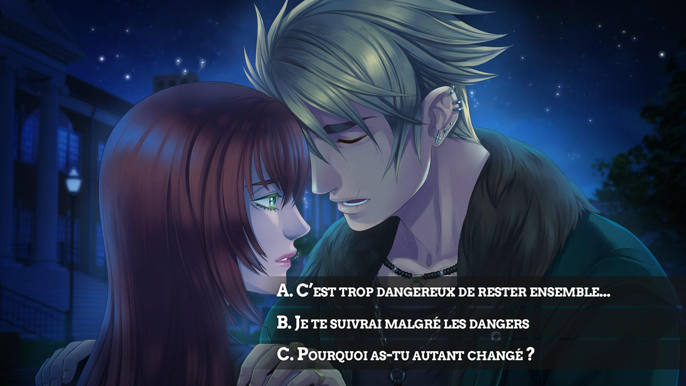
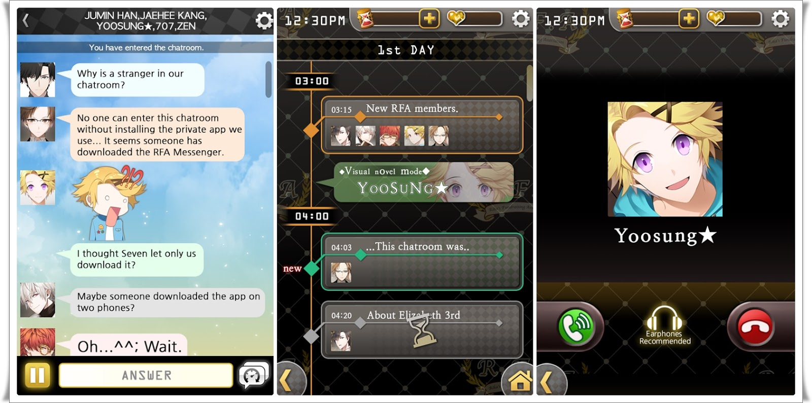
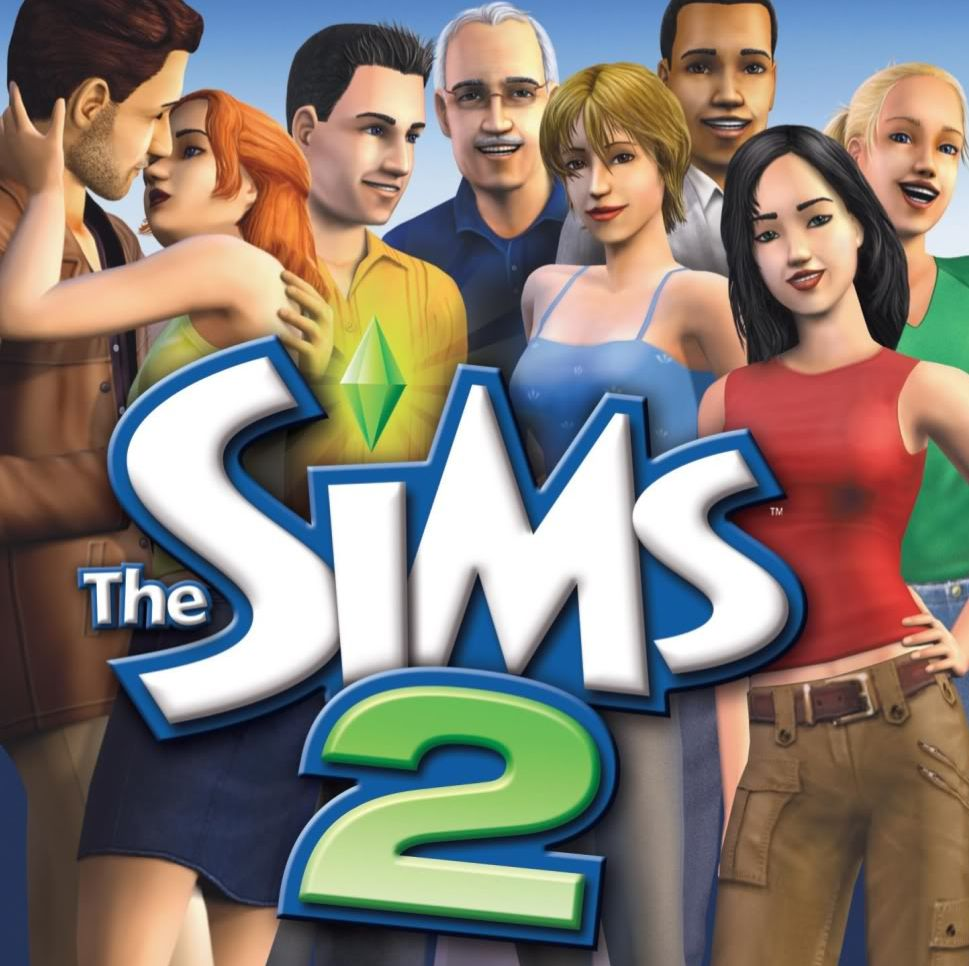

# INSPIRATION

17.04.2023

## TERMS/TOPICS + DEFINITIONS:

Camp: esthétique qui joue avec les extrêmes, le over the top, associé à la communauté queer/gay (voir définition de wikipedia pour plus de détails: https://fr.wikipedia.org/wiki/Camp_(style))

Casual game: « Le casual game (en français, jeu grand public) est un jeu vidéo destiné au large public des joueurs occasionnels (casual gamer). » (Wikipedia: https://fr.wikipedia.org/wiki/Casual_game)

Culture masculiniste: viendrait de « masculinisme ». Opposé du féminisme, valorisation des hommes et domination des femmes (on est sur un truc toxique). (Wikipédia: https://fr.wikipedia.org/wiki/Masculinisme_(id%C3%A9ologie))

Dating games/jeux de drague: Jeux de séduction, simulation de rencard.

Girl games/Pink games (jeux roses): Jeux à destination d’un public féminin, plus grande ampleur entre années 90 et 2000.

Otome game et bishôjo game: Jeux japonais de romance et séduction à destination de public féminin (otome game) ou masculin (bishojo game).

Roleplay: incarnation d’un personnage par un joueur ou une joueuse, par exemple, dans le cadre d’un jeu de rôle.

## 3 POTENTIAL QUESTIONS:

- Est-ce que le gameplay a un genre ?
- « Qu’est-ce que cela fait de jouer à ce jeux vidéo ? Qu’est-ce que cela (nous) fait au genre ? » (Genre et jeux vidéo, p. 141)
- Comment les jeux s’adressent-ils aux femmes ?

## 10 ACADEMIC RESOURCES:

### LIVRES:

BELMHEDI, Racha, Rivalité, nom féminin. Favre, 2022, 240 p.

BERRY, Vincent, Jeux vidéo et adolescence. Les Presses de L’Université Laval: Québec, 2019.

CHOLLET, Mona, Réinventer l'amour - Comment le patriarcat sabote les relations hétérosexuelles. Zones, 2021, 272 p.

LIGNON, Fanny (dir), Genre et jeux vidéo. Presses Universitaires du Midi: Toulouse, 2015, 264 p.

### ARTICLES:

BURNETT, Hannah Eisler, Shame game: Romance novels and feminist shame, a mad lib for collective feeling. Routledge: Abingdon, 2013.

GONG, An-Di, HUANG, Yi-Ting, Finding love in online games: Social interaction, parasocial phenomenon, and in-game purchase intention of female game players. Elsevier Ltd: Oxford, 2023.

MCDONALD, Heidi, Romance in Games: What It Is, How It Is, and How Developers Can Improve It. Michigan State University Press, 2015.

TOMLINSON, Christine, Priority pixels: the social and cultural implications of romance in video games. Routledge: Abingdon, 2021.

### VIDEOS:

Tropes vs Women in Video Games [série de vidéos], Feminist Frequency [en ligne]. 2013 [consulté le 16 avril 2023]. Disponible à l’adresse: https://www.youtube.com/watch?v=X6p5AZp7r_Q&list=PLn4ob_5_ttEaA_vc8F3fjzE62esf9yP61

Geek Remix Podcast Episode 9: History of Pink (feminine) Games and Game Design [vidéo], Geek Remix [en ligne]. 17 avril 2016 [consulté le 16 avril 2023]. Disponible à l’adresse: https://www.youtube.com/watch?v=a2mULYHDSkM&t=214s

### SITES WEBS:

VERBERNE, Lisa. Remembering Pink Games: re-evaluating the forgotten legacy go games « for girls », Feminist Club Amsterdam [en ligne]. 25 février 2022. [consulté le 16 avril 2023]. Disponible à l’adresse: http://www.thefeministclub.nl/2022/02/25/remembering-pink-games-re-evaluating-the-forgotten-legacy-of-games-for-girls/

Femicom [en ligne]. [consulté le 16 avril 2023]. Disponible à l’adresse: http://femicom.org/
http://www.thefeministclub.nl/2022/02/25/remembering-pink-games-re-evaluating-the-forgotten-legacy-of-games-for-girls/

CIESLAK, Karolina, REPORT: Women and games - how moderne female gamer play?, try_evidence [en ligne]. 7 février 2022. [consulté le 16 avril 2023]. Disponible à l’adresse: https://tryevidence.com/blog/report-women-and-games-how-do-modern-female-gamers-play/

### PODCASTS:

Episode 47: Rachel Weil on Femicom and the Value of Preserving Classic « Girl » Video Games [podcast web]. Adam Ruins Everything [en ligne]. 7 mars 2018. [consulté le 17 avril 2023]. Disponible à l’adresse: https://maximumfun.org/episodes/adam-ruins-everything/adam-ruins-everything-episode-47-rachel-weil-femicom-and-value-preserving-clas/

## VISUELS

A lot of visuals are available on: http://femicom.org/collection/images/

## Amour sucré

## Mystic Messenger

## Sims

## Pixel Chix

